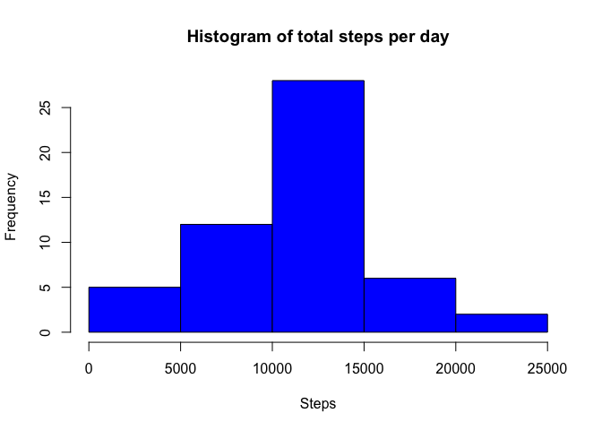
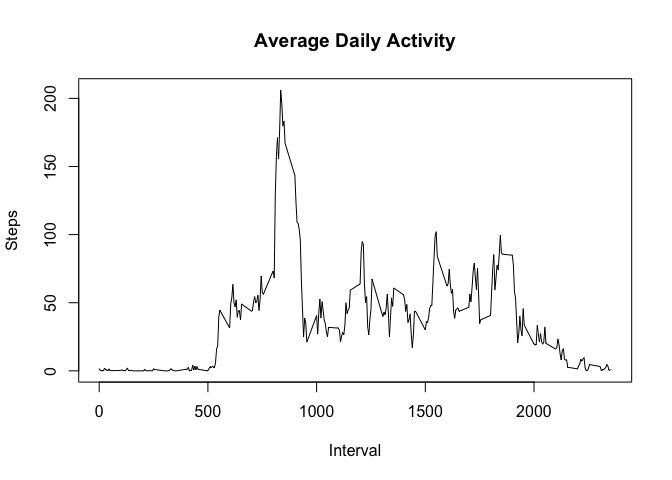
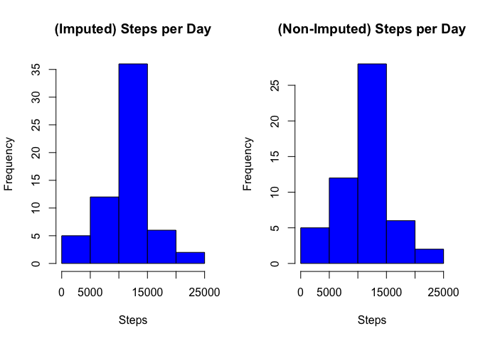
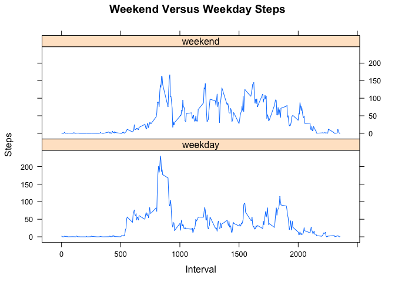

# Reproducible Research: Peer Assessment 1

## Loading and preprocessing the data


```r
url <- "https://d396qusza40orc.cloudfront.net/repdata%2Fdata%2Factivity.zip"
destfile <- "activity.zip"
if (!file.exists(destfile)) {
  download.file(url = url, destfile = destfile, method = "curl")
}

datafile <- "activity.csv"
if(!file.exists(datafile)) {
        unzip(destfile)
}

dataWithNA <- read.table(datafile, header = TRUE, sep = ",")

## Convert date and remove NA values
dataWithNA$date <- as.Date(as.character(dataWithNA$date), "%Y-%m-%d")
data <- dataWithNA[!is.na(dataWithNA$steps),]

head(data)
```

```
##     steps       date interval
## 289     0 2012-10-02        0
## 290     0 2012-10-02        5
## 291     0 2012-10-02       10
## 292     0 2012-10-02       15
## 293     0 2012-10-02       20
## 294     0 2012-10-02       25
```

## What is mean total number of steps taken per day?


```r
library(plyr)

## Total steps by date
stepsSummary <- ddply(data, .(date), summarize, total=sum(steps))
```
### Mean steps taken each day

```r
mean(stepsSummary$total)
```

```
## [1] 10766.19
```
### Median steps taken each day

```r
median(stepsSummary$total)
```

```
## [1] 10765
```

```r
## Histogram of totals steps per day
hist(stepsSummary$total, main = "Histogram of total steps per day", xlab = "Steps", col = "blue")
```

<!-- -->

## What is the average daily activity pattern?


```r
library(plyr)
library(ggplot2)

## Mean steps by interval for every day of data collected
stepsSummary <- ddply(data, .(interval), summarize, avgSteps=mean(steps))

## Plot average steps per interval
plot(avgSteps ~ interval, stepsSummary, type = "l", 
     ylab = "Steps", xlab = "Interval", main = "Average Daily Activity")
```

<!-- -->

####The 5-minute interval that, on average, contains the maximum number of steps


```r
## find interval with maximum average steps
index <- which.max(stepsSummary$avgSteps)
stepsSummary$interval[index]
```

```
## [1] 835
```

## Imputing missing values

### Code to describe and show a strategy for imputing missing data

Missing values can skew the results. Let's first see how big a problem with have by calculating the number of NA values.


```r
naRows <- sum(is.na(dataWithNA$steps))
totalRows <- nrow(dataWithNA)
print("NA Rows:")
```

```
## [1] "NA Rows:"
```

```r
naRows
```

```
## [1] 2304
```

```r
print("Total Rows:")
```

```
## [1] "Total Rows:"
```

```r
totalRows
```

```
## [1] 17568
```

```r
print("Percentages of missing data:")
```

```
## [1] "Percentages of missing data:"
```

```r
naRows / totalRows * 100
```

```
## [1] 13.11475
```
### Create a new dataset by imputing NA values
#### The code replaces NA values with mean values for the given interval.


```r
## Summarize with mean values per interval
stepsSummary <- ddply(data, .(interval), summarize, avgSteps=mean(steps))

## Replace NA values with mean value for interval
cleanData <- dataWithNA
for (row in 1:nrow(cleanData)){
        if (!is.na(cleanData$steps[row]))
                next()
        
        interval <- cleanData$interval[row]
        avgId <- which(stepsSummary$interval == interval)
        cleanData$steps[row] <- stepsSummary$avgSteps[avgId]
}
```
## What is the impact of imputing missing data on the estimates of the total daily number of steps?

```r
stepsSummaryNoNA <- ddply(cleanData, .(date), summarize, total=sum(steps))

stepsSummaryWithNA <- ddply(dataWithNA, .(date), summarize, total=sum(steps))

## Mean total steps by date imputed
mean(stepsSummaryNoNA$total)
```

```
## [1] 10766.19
```

```r
## Mean totals steps
mean(stepsSummaryWithNA$total, na.rm=TRUE)
```

```
## [1] 10766.19
```

```r
## Median total steps by date imputed
median(stepsSummaryNoNA$total)
```

```
## [1] 10766.19
```

```r
## Median totals steps
median(stepsSummaryWithNA$total, na.rm=TRUE)
```

```
## [1] 10765
```

```r
## Sum total steps imputed
sum(stepsSummaryNoNA$total)
```

```
## [1] 656737.5
```

```r
## Sum totals steps
sum(stepsSummaryWithNA$total, na.rm=TRUE)
```

```
## [1] 570608
```

### Imputing produces a slight change in the median number of steps per day and total steps observed is increased significantly. In the histograms the observed frequency increases.

## Histogram of total steps by day Imputed vs Non-Imputed

```r
par(mfrow=c(1,2))
hist(stepsSummaryNoNA$total, main = "(Imputed) Steps per Day", xlab = "Steps", col = "blue")
hist(stepsSummaryWithNA$total, main = "(Non-Imputed) Steps per Day", xlab = "Steps", col = "blue")
```

<!-- -->

## Are there differences in activity patterns between weekdays and weekends?

### Yes!


```r
## Add new column with day name
cleanData$day <- weekdays(cleanData$date)
weekday <- c("Monday", "Tuesday", "Wednesday", "Thursday", "Friday")
weekend <- c("Saturday", "Sunday")

## Subset data by weekend and weekday
weekdayData <- cleanData[cleanData$day %in% weekday,]
weekendData <- cleanData[cleanData$day %in% weekend,]

## Summarize weekend and weekday data mean steps per interval
stepsSummaryWeekday <- ddply(weekdayData, .(interval), summarize, avgSteps=mean(steps))
stepsSummaryWeekend <- ddply(weekendData, .(interval), summarize, avgSteps=mean(steps))

## Plot average steps per interval weekday vs weekend
par(mfrow = c(1,2))
plot(avgSteps ~ interval, stepsSummaryWeekday, type = "l", 
     ylab = "Steps", xlab = "Interval", main = "Weekday Activity")
plot(avgSteps ~ interval, stepsSummaryWeekend, type = "l", 
     ylab = "Steps", xlab = "Interval", main = "Weekend Activity")
```

<!-- -->
